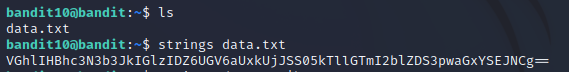

# Level 10 -> Level 11
Dùng password `G7w8LIi6J3kTb8A7j9LgrywtEUlyyp6s` để truy cập vào bandit11

Dùng `ls` ta thấy có 1 file `data.txt`. Dùng strings data.txt để xem chuỗi bên trong file

Ta cần decode base64 đoạn mã này. Ta dùng lệnh `base64 -d` và tìm được password 

Password cần tìm là: `6zPeziLdR2RKNdNYFNb6nVCKzphlXHBM`
