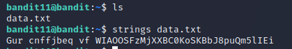
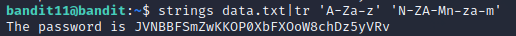

# Level 11 -> Level 12
Dùng password `6zPeziLdR2RKNdNYFNb6nVCKzphlXHBM` để truy cập vào bandit11

Dùng `ls` ta thấy có 1 file `data.txt`. Dùng `strings data.txt` để xem chuỗi bên trong file

Ta cần luân chuyển những chuỗi trên 13 kí tự. Ta dùng lệnh `tr 'A-Za-z' 'N-ZA-Mn-za-m'` để dịch chuyển đi 13 kí tự

Password cần tìm là: `JVNBBFSmZwKKOP0XbFXOoW8chDz5yVRv`
