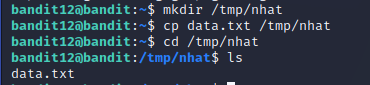
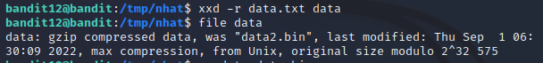
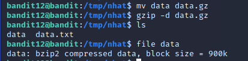
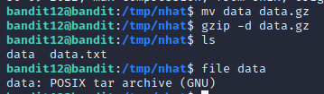
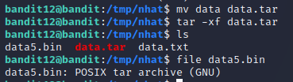
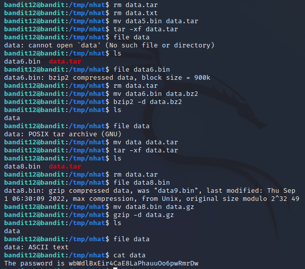

# Level 12 -> Level 13
>The password for the next level is stored in the file data.txt, which is a hexdump of a file that has been repeatedly compressed. For this level it may be useful to create a directory under /tmp in which you can work using mkdir. For example: mkdir /tmp/myname123. Then copy the datafile using cp, and rename it using mv (read the manpages!)

Dùng password `JVNBBFSmZwKKOP0XbFXOoW8chDz5yVRv` để truy cập vào bandit12

Dùng `ls` ta thấy có 1 file `data.txt`. Dùng `strings data.txt` để xem file 

Để thuận tiện xử lí file ta tạo một thư mục mới `/tmp/nhat` rồi sao chép file `data.txt` về đó.

Vì `data.txt` là 1 file `hexdump`. Ta reverse bằng lệnh `xxd` để chuyển file về dạng binary

Vì file `data` có dạng `gzip` nên ta chuyển file `data` thành `data.gzip` và giải nén, ta được file `data` dạng `bzip2`

Tiếp tục `mv` file về dạng `data.bz2` rồi giải nén, ta được file `data` dạng `gzip`

Tiếp tục giải nén như trên ta được file dạng `tar`

`mv` file về dạng `data.tar` rồi giải nén ta được file tiếp tục dạng `tar` 

Ta liên tục lặp lại các bước như trên rồi giải nén, ta cuối cùng cũng tìm được file chứa password 

Password cần tìm là: `wbWdlBxEir4CaE8LaPhauuOo6pwRmrDw`
