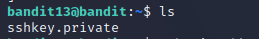
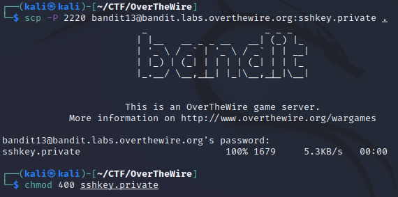
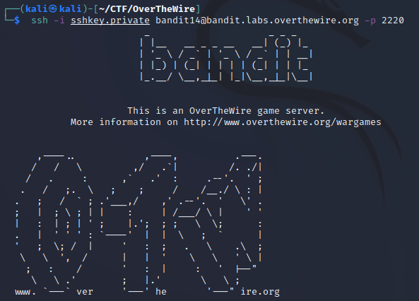
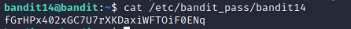

# Level 13 -> Level 14
> The password for the next level is stored in /etc/bandit_pass/bandit14 and can only be read by user bandit14. For this level, you don’t get the next password, but you get a private SSH key that can be used to log into the next level. Note: localhost is a hostname that refers to the machine you are working on

Dùng password `wbWdlBxEir4CaE8LaPhauuOo6pwRmrDw` để truy cập vào bandit13

Dùng `ls` ta thấy được 1 private key ssh 

Ta dùng lệnh `scp` để download key về máy, sau đó thiết lập cấp quyền read cho user  

Dùng `ssh` truy cập ở local,  sau đó `cat /etc/bandit_pass/bandit14` ta được password

Password cần tìm là: `fGrHPx402xGC7U7rXKDaxiWFTOiF0ENq`

