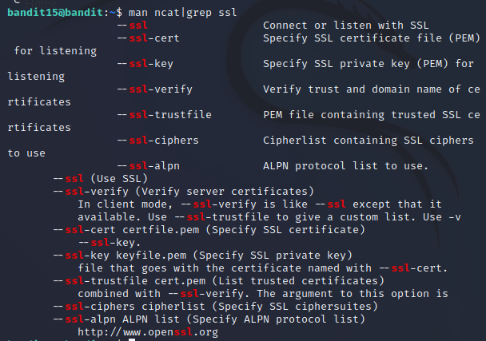
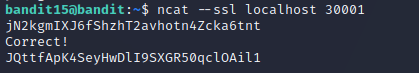

# Level 15 -> Level 16
>The password for the next level can be retrieved by submitting the password of the current level to port 30001 on localhost using SSL encryption.

Dùng password `jN2kgmIXJ6fShzhT2avhotn4Zcka6tnt` để truy cập vào bandit15

Đầu tiên ta dùng lệnh `cat /etc/bandit_pass/bandit15` để lấy password cần gởi. 

Sau khi thử lệnh `nc` không thành công vì không options `ssl`, em thử qua lệnh `ncat` thì tìm thấy options `ssl` để thực thi

Thưc thi lệnh `ncat --ssl localhost 30001` rồi gởi password đã kiếm ở trên ta được password cần tìm

Passwword cần tìm là: `JQttfApK4SeyHwDlI9SXGR50qclOAil1`
