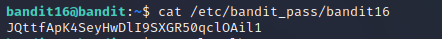
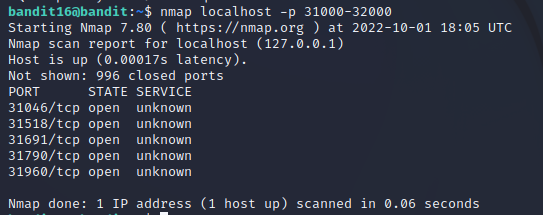
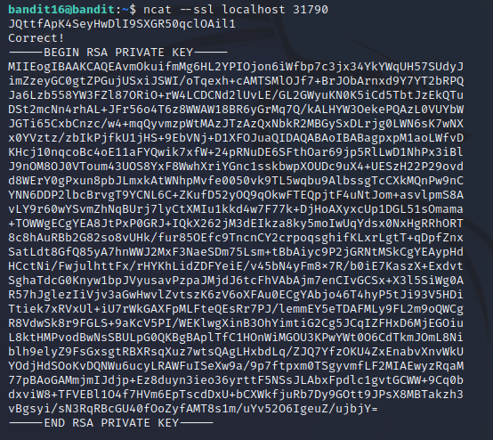
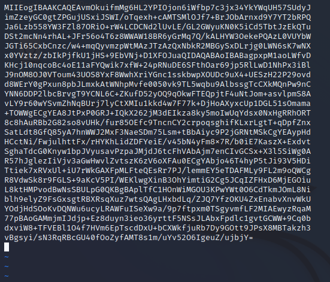
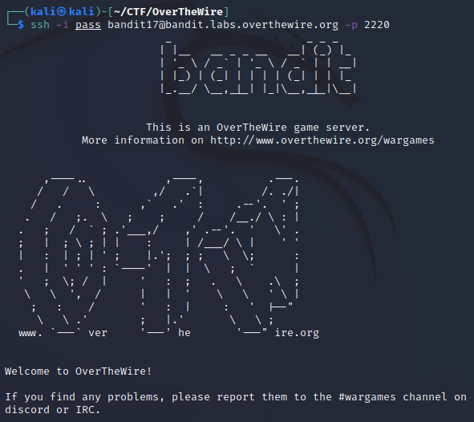
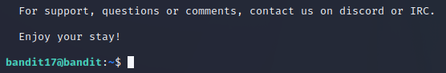

# Level 16 -> Level 17
>The credentials for the next level can be retrieved by submitting the password of the current level to a port on localhost in the range 31000 to 32000. First find out which of these ports have a server listening on them. Then find out which of those speak SSL and which don’t. There is only 1 server that will give the next credentials, the others will simply send back to you whatever you send to it.

Dùng password `JQttfApK4SeyHwDlI9SXGR50qclOAil1` để truy cập vào bandit16

Đầu tiên ta dùng lệnh `cat /etc/bandit_pass/bandit16` để lấy password cần gửi. 

Ta dùng lệnh `nmap localhost -p 31000-32000` để xem các port trong khoảng từ 31000 đến 32000

Thử gửi password với từng port bằng lệnh `ncat` thì chỉ có port 31790 trả về correct 1 key rsa còn tất cả port khác chỉ gởi pass lại password mà mình đã gửi

`Copy` key rồi `exit` bandit16, sau đó `paste` vào trình soạn thảo vim với tên pass rồi lưu lại. 

Chạy lệnh `ssh -i pass bandit17@bandit.labs.overthewire.org -p 2220`, ta truy cập được vào bandit17

