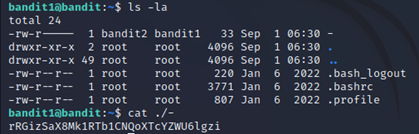

# Level 1 -> Level 2
Dùng mật khẩu 'NH2SXQwcBdpmTEzi3bvBHMM9H66vVXjL' truy cập vào bandit1 (Tương tự như cách tuy cập vào bandit0)
Dùng lệnh 'cat ./-' để lấy password truy cập vào bandit2

Password cần tìm là: 'rRGizSaX8Mk1RTb1CNQoXTcYZWU6lgzi'