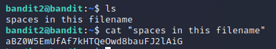

# Level 2 -> Level 3
> The password for the next level is stored in a file called spaces in this filename located in the home directory

Dùng password `rRGizSaX8Mk1RTb1CNQoXTcYZWU6lgzi` truy cập vào bandit2 

Dùng lệnh `cat “spaces in this filename”` để lấy password truy cập vào bandit3

Password cần tìm là: `aBZ0W5EmUfAf7kHTQeOwd8bauFJ2lAiG`
