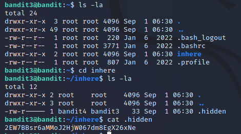

# Level 3 -> Level 4
> The password for the next level is stored in a hidden file in the inhere directory.

Dùng password `aBZ0W5EmUfAf7kHTQeOwd8bauFJ2lAiG` truy cập vào bandit3

Dùng lệnh `ls -la` để xem tất cả các file kể cả file ẩn trong thư mục hiện hành

Vào thư mục `inhere` và sử dụng `ls -la` lần nữa ta thấy có 1 file ẩn là `.hidden`

Dùng lệnh `cat .hidden` để xem file ẩn

Password cần tìm là: `2EW7BBsr6aMMoJ2HjW067dm8EgX26xNe`
