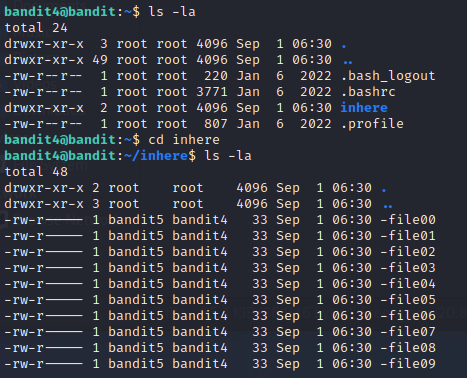
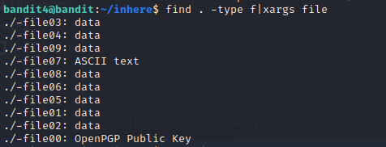
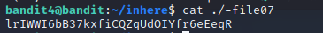

# Level 4 -> Level 5
Dùng mật khẩu `2EW7BBsr6aMMoJ2HjW067dm8EgX26xNe` truy cập vào bandit4

Dùng lệnh `ls -la` và thấy có thư mục `inhere`. Vào thư mục `inhere` thì thấy có 10 file 

Vấn đề đặt ra là ta cần xem thử bên trong 10 file đó có dữ liệu dạng gì. Ta dùng lệnh `find . -type f|xargs file` 

Ta thấy `-file07` có dạng ASCII text, ta mở ra xem thử thì thấy password cần tìm

Password cần tìm là: `lrIWWI6bB37kxfiCQZqUdOIYfr6eEeqR`
