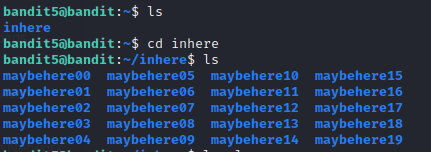
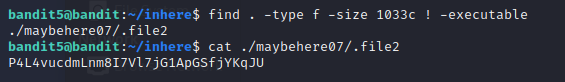

# Level 5 -> Level 6
> The password for the next level is stored in a file somewhere under the inhere directory and has all of the following properties:
human-readable
1033 bytes in size
not executable

Dùng password `lrIWWI6bB37kxfiCQZqUdOIYfr6eEeqR` truy cập vào bandit5

Ta thấy có thư mục `inhere`. Truy cập vào thử thì thấy có 20 thư mục

Ta cần tìm file theo đúng yêu cầu là `human-readable, 1033 bytes in size, not executable`. Ta dùng lệnh `find . -type f -size 1033c ! -executable` và thấy có file cần tìm. Lưu ý rằng kí hiệu của `byte` là `c`

Mở file và ta nhận được password

Password cần tìm là: `P4L4vucdmLnm8I7Vl7jG1ApGSfjYKqJU`
