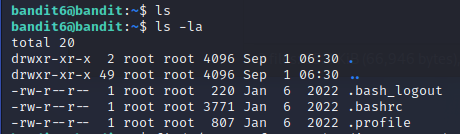
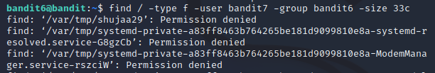
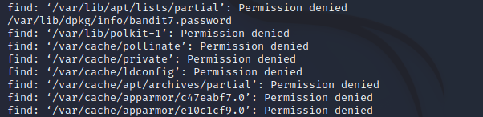
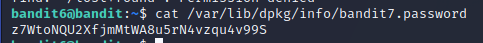

# Level 6 -> Level 7

Dùng password `P4L4vucdmLnm8I7Vl7jG1ApGSfjYKqJU` truy cập vào bandit6

Xem thử có file hay thư mục nào ở thư mục hiện hành không thì ta nhận ra không có gì cả

Điều đặt ra ở đây là ta cần tìm `file` ở nơi nào đó có yêu cầu `owned by user bandit7, owned by group bandit6, 33 bytes in size`. Ta dùng lệnh `find / -type f -user bandit7 -group bandit6 -size 33c` để tìm kiếm. 

Sau một lúc tìm kiếm thì ta tìm được đường dẫn `/var/lib/dpkg/info/bandit7.password` không bị `Permission denied`

Mở file và ta được password cần tìm

Password cần tìm là: `z7WtoNQU2XfjmMtWA8u5rN4vzqu4v99S`
