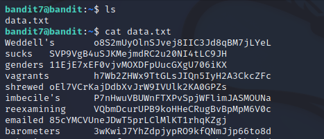
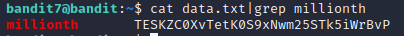

# Level 7 -> Level 8
Dùng password `z7WtoNQU2XfjmMtWA8u5rN4vzqu4v99S` để truy cập vào bandit7

Dùng `ls` thì ta thấy được 1 file `data.txt`. Mở file thì ta nhận được các chuỗi khác nhau

Ta dùng lệnh `cat data.txt|grep millionth` để tìm kiếm từ khóa `millionth` trong file không thì ta tìm thấy kèm với password

Password cần tìm là: `TESKZC0XvTetK0S9xNwm25STk5iWrBvP`
