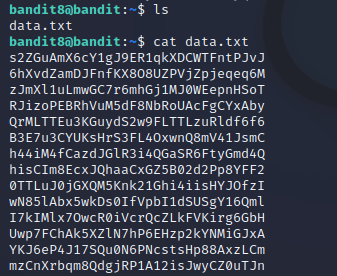

# Level 8 -> Level 9
Dùng password `TESKZC0XvTetK0S9xNwm25STk5iWrBvP` để truy cập vào bandit8

Dùng `ls` ta thấy có 1 file `data.txt`. Mở file để xem thử thì thấy có rất nhiều chuỗi

Ta cần tìm chuỗi chỉ xảy ra 1 lần. Ta dùng lệnh `sort data.txt|uniq -c|grep "1 "` với `sort` sẽ sắp xếp file, 'uniq -c' sẽ đếm số lượng file lặp và `grep "1 "` sẽ kiếm chuỗi có lần lặp là 1 

Password cần tìm là: `EN632PlfYiZbn3PhVK3XOGSlNInNE00t`
