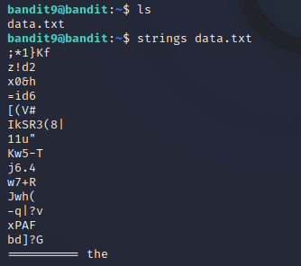
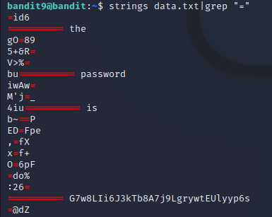

# Level 9 -> Level 10
> The password for the next level is stored in the file data.txt in one of the few human-readable strings, preceded by several ‘=’ characters.

Dùng password `EN632PlfYiZbn3PhVK3XOGSlNInNE00t` để truy cập vào bandit9

Dùng `ls` ta thấy có 1 file `data.txt`. Dùng `strings data.txt` để xem chuỗi bên trong file

Đề yêu cầu password đứng trước 1 số dấu "=". Vì vậy nên ta `grep "="` thử và tìm thấy password

Password cần tìm là: `G7w8LIi6J3kTb8A7j9LgrywtEUlyyp6s`
