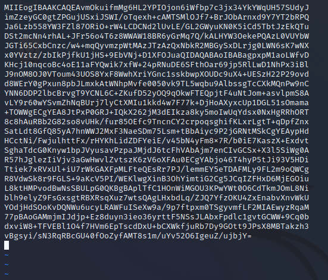
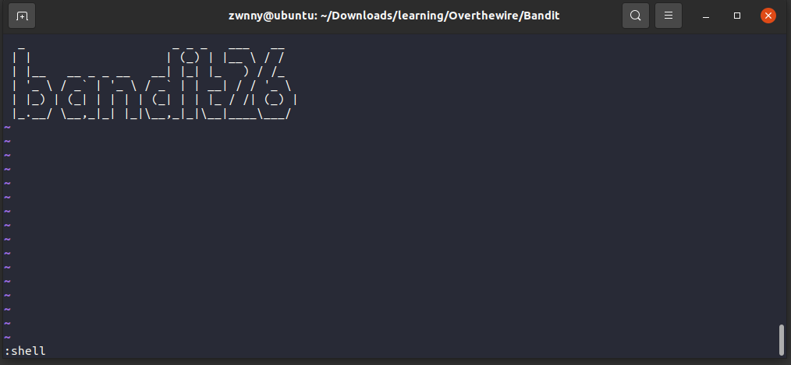

# OverTheWire - Wargames_bandit
**Nhom06 - NT101.N11.ANTN**
> **SVTH: Võ Duy Nhất - MSSV: 20521711**
> 
> **SVTH: Lê Thành Đạt - MSSV: 20521168**

## Level 0
>The goal of this level is for you to log into the game using SSH. The host to which you need to connect is bandit.labs.overthewire.org, on port 2220. The username is bandit0 and the password is bandit0. Once logged in, go to the Level 1 page to find out how to beat Level 1.

Sử dụng ssh truy cập vào `bandit.labs.overthewire.org` với username `bandit0`, password `bandit0` với port 2220


## Level 0 -> Level 1
> The password for the next level is stored in a file called readme located in the home directory. Use this password to log into bandit1 using SSH. Whenever you find a password for a level, use SSH (on port 2220) to log into that level and continue the game.

Đầu tiên, ta dùng lệnh `ls` để liệt kê danh sách các file và thư mục tại thư mục hiện hành thì ta thấy có file `readme`

Dùng lệnh `cat readme` để lấy password truy cập vào bandit1


Password cần tìm là: `NH2SXQwcBdpmTEzi3bvBHMM9H66vVXjL`

## Level 1 -> Level 2
> The password for the next level is stored in a file called - located in the home directory

Dùng password `NH2SXQwcBdpmTEzi3bvBHMM9H66vVXjL` truy cập vào bandit1 (Tương tự như cách tuy cập vào bandit0)

Tiếp theo, ta dùng lệnh `ls` thì thấy có file tên là `-`

Dùng lệnh `cat ./-` để lấy password truy cập vào bandit2


Password cần tìm là: `rRGizSaX8Mk1RTb1CNQoXTcYZWU6lgzi`

## Level 2 -> Level 3
> The password for the next level is stored in a file called spaces in this filename located in the home directory

Dùng password `rRGizSaX8Mk1RTb1CNQoXTcYZWU6lgzi` truy cập vào bandit2 

Dùng lệnh `ls` thì thấy có file tên là `spaces in this filename`

Dùng lệnh `cat “spaces in this filename”` để lấy password truy cập vào bandit3


Password cần tìm là: `aBZ0W5EmUfAf7kHTQeOwd8bauFJ2lAiG`

## Level 3 -> Level 4
> The password for the next level is stored in a hidden file in the inhere directory.

Dùng password `aBZ0W5EmUfAf7kHTQeOwd8bauFJ2lAiG` truy cập vào bandit3

Dùng lệnh `ls -la` để xem toàn bộ thông tin của file và những file ẩn trong thư mục hiện hành

Vào thư mục `inhere` và sử dụng `ls -la` lần nữa ta thấy có 1 file ẩn là `.hidden`

Dùng lệnh `cat .hidden` để xem file ẩn


Password cần tìm là: `2EW7BBsr6aMMoJ2HjW067dm8EgX26xNe`

## Level 4 -> Level 5
> The password for the next level is stored in the only human-readable file in the inhere directory. Tip: if your terminal is messed up, try the “reset” command.

Dùng password `2EW7BBsr6aMMoJ2HjW067dm8EgX26xNe` truy cập vào bandit4

Dùng lệnh `ls -la` và thấy có thư mục `inhere`. Vào thư mục `inhere` thì thấy có 10 file 


Vấn đề đặt ra là ta cần xem thử bên trong 10 file đó có dữ liệu dạng gì. Ta dùng lệnh `find . -type f|xargs file` 


Ta thấy `-file07` có dạng ASCII text, ta mở ra xem thử thì thấy password cần tìm


## Level 5 -> Level 6
>The password for the next level is stored in a file somewhere under the inhere directory and has all of the following properties:
>- human-readable
>- 1033 bytes in size
>- not executable

Dùng password `lrIWWI6bB37kxfiCQZqUdOIYfr6eEeqR` truy cập vào bandit5

Ta thấy có thư mục `inhere`. Truy cập vào thử thì thấy có 20 thư mục


Ta cần tìm file theo đúng yêu cầu là `human-readable, 1033 bytes in size, not executable`. Ta dùng lệnh `find . -type f -size 1033c ! -executable` và thấy có file cần tìm. Lưu ý rằng kí hiệu của `byte` là `c`

Mở file và ta nhận được password


Password cần tìm là: `P4L4vucdmLnm8I7Vl7jG1ApGSfjYKqJU`

## Level 6 -> Level 7
>The password for the next level is stored somewhere on the server and has all of the following properties:
>- owned by user bandit7
>- owned by group bandit6
>- 33 bytes in size

Dùng password `P4L4vucdmLnm8I7Vl7jG1ApGSfjYKqJU` truy cập vào bandit6

Xem thử có file hay thư mục nào ở thư mục hiện hành không thì ta nhận ra không có gì cả


Điều đặt ra ở đây là ta cần tìm `file` ở nơi nào đó có yêu cầu `owned by user bandit7, owned by group bandit6, 33 bytes in size`. Ta dùng lệnh `find / -type f -user bandit7 -group bandit6 -size 33c` để tìm kiếm. 


Sau một lúc tìm kiếm thì ta tìm được đường dẫn `/var/lib/dpkg/info/bandit7.password` không bị `Permission denied`


Mở file và ta được password cần tìm


Password cần tìm là: `z7WtoNQU2XfjmMtWA8u5rN4vzqu4v99S`

## Level 7 -> Level 8
>The password for the next level is stored in the file data.txt next to the word millionth

Dùng password `z7WtoNQU2XfjmMtWA8u5rN4vzqu4v99S` để truy cập vào bandit7

Dùng `ls` thì ta thấy được 1 file `data.txt`. Mở file thì ta nhận được các chuỗi khác nhau


Ta dùng lệnh `cat data.txt|grep millionth` để tìm kiếm từ khóa `millionth` trong file thì ta tìm thấy kèm với password


Password cần tìm là: `TESKZC0XvTetK0S9xNwm25STk5iWrBvP`

## Level 8 -> Level 9
>The password for the next level is stored in the file data.txt and is the only line of text that occurs only once

Dùng password `TESKZC0XvTetK0S9xNwm25STk5iWrBvP` để truy cập vào bandit8

Dùng `ls` ta thấy có 1 file `data.txt`. Mở file để xem thử thì thấy có rất nhiều chuỗi


Ta cần tìm chuỗi chỉ xảy ra 1 lần. Ta dùng lệnh `sort data.txt|uniq -c|grep "1 "` với `sort` sẽ sắp xếp file, `uniq -c` sẽ đếm số lượng file lặp và `grep "1 "` sẽ kiếm chuỗi có lần lặp là 1 


Password cần tìm là: `EN632PlfYiZbn3PhVK3XOGSlNInNE00t`

## Level 9 -> Level 10
> The password for the next level is stored in the file data.txt in one of the few human-readable strings, preceded by several ‘=’ characters.

Dùng password `EN632PlfYiZbn3PhVK3XOGSlNInNE00t` để truy cập vào bandit9

Dùng `ls` ta thấy có 1 file `data.txt`. Dùng `strings data.txt` để xem chuỗi bên trong file


Đề yêu cầu password đứng trước 1 số dấu "=". Vì vậy nên ta `grep "="` thử và tìm thấy password


Password cần tìm là: `G7w8LIi6J3kTb8A7j9LgrywtEUlyyp6s`

## Level 10 -> Level 11
> The password for the next level is stored in the file data.txt, which contains base64 encoded data

Dùng password `G7w8LIi6J3kTb8A7j9LgrywtEUlyyp6s` để truy cập vào bandit11

Dùng `ls` ta thấy có 1 file `data.txt`. Dùng `strings data.txt` để xem chuỗi bên trong file


Ta cần decode base64 đoạn mã này. Ta dùng lệnh `base64 -d` và tìm được password 


Password cần tìm là: `6zPeziLdR2RKNdNYFNb6nVCKzphlXHBM`

## Level 11 -> Level 12
> The password for the next level is stored in the file data.txt, where all lowercase (a-z) and uppercase (A-Z) letters have been rotated by 13 positions

Dùng password `6zPeziLdR2RKNdNYFNb6nVCKzphlXHBM` để truy cập vào bandit11

Dùng `ls` ta thấy có 1 file `data.txt`. Dùng `strings data.txt` để xem chuỗi bên trong file


Ta cần luân chuyển những chuỗi trên 13 kí tự. Ta dùng lệnh `tr 'A-Za-z' 'N-ZA-Mn-za-m'` để dịch chuyển đi 13 kí tự


Password cần tìm là: `JVNBBFSmZwKKOP0XbFXOoW8chDz5yVRv`

## Level 12 -> Level 13
>The password for the next level is stored in the file data.txt, which is a hexdump of a file that has been repeatedly compressed. For this level it may be useful to create a directory under /tmp in which you can work using mkdir. For example: mkdir /tmp/myname123. Then copy the datafile using cp, and rename it using mv (read the manpages!)

Dùng password `JVNBBFSmZwKKOP0XbFXOoW8chDz5yVRv` để truy cập vào bandit12

Dùng `ls` ta thấy có 1 file `data.txt`. Dùng `strings data.txt` để xem file 


Để thuận tiện xử lí file ta tạo một thư mục mới `/tmp/nhat` rồi sao chép file `data.txt` về đó.


Vì `data.txt` là 1 file `hexdump`. Ta reverse bằng lệnh `xxd` để chuyển file về dạng binary


Vì file `data` có dạng `gzip` nên ta chuyển file `data` thành `data.gzip` và giải nén, ta được file `data` dạng `bzip2`


Tiếp tục `mv` file về dạng `data.bz2` rồi giải nén, ta được file `data` dạng `gzip`


Tiếp tục giải nén như trên ta được file dạng `tar`


`mv` file về dạng `data.tar` rồi giải nén ta được file tiếp tục dạng `tar` 


Ta liên tục lặp lại các bước như trên rồi giải nén, ta cuối cùng cũng tìm được file chứa password 


Password cần tìm là: `wbWdlBxEir4CaE8LaPhauuOo6pwRmrDw`

## Level 13 -> Level 14
> The password for the next level is stored in /etc/bandit_pass/bandit14 and can only be read by user bandit14. For this level, you don’t get the next password, but you get a private SSH key that can be used to log into the next level. Note: localhost is a hostname that refers to the machine you are working on

Dùng password `wbWdlBxEir4CaE8LaPhauuOo6pwRmrDw` để truy cập vào bandit13

Dùng `ls` ta thấy được 1 private key ssh 


Ta dùng lệnh `scp` để download key về máy, sau đó thiết lập cấp quyền read cho user  


Dùng `ssh` truy cập ở local,  sau đó `cat /etc/bandit_pass/bandit14` ta được password


Password cần tìm là: `fGrHPx402xGC7U7rXKDaxiWFTOiF0ENq`

## Level 14 -> Level 15
> The password for the next level can be retrieved by submitting the password of the current level to port 30000 on localhost.

Ở challenge trước ta tìm được password là `fGrHPx402xGC7U7rXKDaxiWFTOiF0ENq`. Dùng `nc`, gửi password này đến port 30000 ta được password


Password cần tìm là: `jN2kgmIXJ6fShzhT2avhotn4Zcka6tnt`

## Level 15 -> Level 16
>The password for the next level can be retrieved by submitting the password of the current level to port 30001 on localhost using SSL encryption.

Dùng password `jN2kgmIXJ6fShzhT2avhotn4Zcka6tnt` để truy cập vào bandit15

Đầu tiên ta dùng lệnh `cat /etc/bandit_pass/bandit15` để lấy password cần gửi. 


Sau khi thử lệnh `nc` không thành công vì không options `ssl`, em thử qua lệnh `ncat` thì tìm thấy options `ssl` để thực thi


Thưc thi lệnh `ncat --ssl localhost 30001` rồi gửi password đã kiếm ở trên ta được password cần tìm


Passwword cần tìm là: `JQttfApK4SeyHwDlI9SXGR50qclOAil1`

## Level 16 -> Level 17
>The credentials for the next level can be retrieved by submitting the password of the current level to a port on localhost in the range 31000 to 32000. First find out which of these ports have a server listening on them. Then find out which of those speak SSL and which don’t. There is only 1 server that will give the next credentials, the others will simply send back to you whatever you send to it.

Dùng password `JQttfApK4SeyHwDlI9SXGR50qclOAil1` để truy cập vào bandit16

Đầu tiên ta dùng lệnh `cat /etc/bandit_pass/bandit16` để lấy password cần gửi. 


Ta dùng lệnh `nmap localhost -p 31000-32000` để xem các port trong khoảng từ 31000 đến 32000


Thử gửi password với từng port bằng lệnh `ncat` thì chỉ có port 31790 trả về correct 1 key rsa còn tất cả port khác chỉ gửi lại password mà mình đã gửi


`Copy` key rồi `exit` bandit16, sau đó `paste` vào trình soạn thảo vim với tên pass rồi lưu lại. 



Chạy lệnh `ssh -i pass bandit17@bandit.labs.overthewire.org -p 2220`, ta truy cập được vào bandit17


## Level 17 -> Level 18
>There are 2 files in the homedirectory: **passwords.old and passwords.new**. The password for the next level is in **passwords.new** and is the only line that has been changed between **passwords.old and passwords.new**

Dùng rsa key đã tìm được ở level 16 để đăng nhập vào level 17
Theo mô tả, password là dòng khác nhau của file `passwords.new` giữa 2 file `passwords.old` và `passwords.new` . 
Sử dụng lệnh `diff passwords.old passwords.new`, password là chuỗi sau kí tự `>`


Password cần tìm là: `hga5tuuCLF6fFzUpnagiMN8ssu9LFrdg`


## Level 18 -> Level 19
> The password for the next level is stored in a file **readme** in the homedirectory. Unfortunately, someone has modified **.bashrc** to log you out when you log in with SSH.

Ta cần đọc nội dung file `readme` để lấy password
Nếu ta đăng nhập như cách thông thường thì sẽ bị log out.
Có 1 cách để thực thi lệnh ngay lúc log in bằng ssh, đó là cung cấp tham số cho ssh là lệnh ta muốn thực thi nếu log in thành công
`ssh bandit18@bandit.labs.overthewire.org -p 2220 cat readme`


Password: `awhqfNnAbc1naukrpqDYcF95h7HoMTrC`

## Level 19 -> Level 20
>To gain access to the next level, you should use the setuid binary in the homedirectory. Execute it without arguments to find out how to use it. The password for this level can be found in the usual place (/etc/bandit_pass), after you have used the setuid binary.

Thực thi file `bandit20-do`, ta thấy usage của file này cho phép ta thực thi lệnh bằng quyền của user `bandit20`

Vậy ta có thể thực thi file `bandit20-do` với tham số `cat /etc/bandit_pass/bandit20` để đọc password.


Password: `VxCazJaVykI6W36BkBU0mJTCM8rR95XT`
## Level 20 -> Level 21
>There is a setuid binary in the homedirectory that does the following: it makes a connection to localhost on the port you specify as a commandline argument. It then reads a line of text from the connection and compares it to the password in the previous level (bandit20). If the password is correct, it will transmit the password for the next level (bandit21).


Theo mô tả, chương trình `suconnect` sẽ kết nối đến cổng được chỉ định làm tham số cho chương trình này. Sau đó, chương trình sẽ đọc dữ liệu từ kết nối, so sánh dữ liệu này với password để log in vào level 20, nếu khớp sẽ in ra password của level 21.
Ta có các bước làm như sau:
1.  Khởi tạo lắng nghe ở port 4444 dùng làm server (có thể là bất kì port nào hệ thống cho phép)
2. Chạy `suconnect 4444` (client) để khởi tạo khởi nối đến server
3. Từ server gửi `VxCazJaVykI6W36BkBU0mJTCM8rR95XT`  (password để log in vào level 20) đến client
4. Client sẽ in ra password
5. Ta dùng `Ctrl-Z` và lệnh `fg` để chuyển đổi giữa 2 process server và client


Password: `NvEJF7oVjkddltPSrdKEFOllh9V1IBcq`
## Level 21 -> Level 22
>A program is running automatically at regular intervals from **cron**, the time-based job scheduler. Look in **/etc/cron.d/** for the configuration and see what command is being executed.

Ta liệt kê các file có trong thư mục `/etc/cron.d/`, đọc nội dung file `/etc/cron.d/cronjob_bandit22`


`* * * * * bandit22 /usr/bin/cronjob_bandit22.sh &> /dev/null`

Mỗi phút, hệ thống sẽ thực thi file `/usr/bin/cronjob_bandit22.sh` dưới quyền user `bandit22`
Kiểm tra nội dung file `/usr/bin/cronjob_bandit22.sh`


Khi file `/usr/bin/cronjob_bandit22.sh` được thực thi, hệ thống sẽ ghi vào file `/tmp/t7O6lds9S0RqQh9aMcz6ShpAoZKF7fgv` password của level 22. Tất cả người dùng có quyền đọc file `/tmp/t7O6lds9S0RqQh9aMcz6ShpAoZKF7fgv`
Vậy chỉ cần đọc file `/tmp/t7O6lds9S0RqQh9aMcz6ShpAoZKF7fgv` sẽ có password


Password: `WdDozAdTM2z9DiFEQ2mGlwngMfj4EZff`

## Level 22 -> Level 23
> A program is running automatically at regular intervals from **cron**, the time-based job scheduler. Look in **/etc/cron.d/** for the configuration and see what command is being executed.

Tương tự như Level 21, ta sẽ đọc đọc file `/etc/cron.d/cronjob_bandit23` để tìm thông tin liên quan đến password


Mỗi phút, hệ thống sẽ thực thi file `/usr/bin/cronjob_bandit23.sh` dưới quyền user `bandit23`
Kiểm tra nội dung file `/usr/bin/cronjob_bandit23.sh`


Khi file `/usr/bin/cronjob_bandit23.sh` được thực thi, hệ thống sẽ copy password của level 23 vào file /tmp/`mytarget`
`mytarget` là kết quả khi thực thi lệnh `echo  I am user bandit23 | md5sum | cut -d ' ' -f 1`
Vậy ta chỉ cần thực thi lệnh trên để có được giá trị `mytarget`. Sau đó đọc file `/tmp/mytarget`


Password: `QYw0Y2aiA672PsMmh9puTQuhoz8SyR2G`

## Level 23 -> Level 24
>A program is running automatically at regular intervals from **cron**, the time-based job scheduler. Look in **/etc/cron.d/** for the configuration and see what command is being executed.

Như 2 challenges trước, đầu tiên ta đọc file `/usr/bin/cronjob_bandit24.sh` 


Khi file `/usr/bin/cronjob_bandit24.sh` được chạy, hệ thống sẽ "quét qua" những file trong thư mục `/var/spool/bandit24/foo` . File sẽ được thực thi dưới quyền user `bandit24`  nếu thuộc sở hữu của user `bandit23`
Xem qua quyền của thư mục `/var/spool/bandit24/`. Ta thấy mọi user đều có quyền ghi và thực thi đối với thư mục `foo`.
Vậy ta có thể tạo 1 file script `solve.sh` dưới quyền `bandit23`, copy file `solve.sh` vào thư mục `foo`
Nội dung của script `solve.sh` sẽ là ghi password của level 24 vào một file mà user `bandit23` có thể đọc được
Các bước làm như sau:
1. Tạo thư mục bằng lệnh `mkdir /tmp/ltd`
2. Chuyển đến thư mục `ltd`
3. Tạo file `password24.txt` bên trong thư mục `ltd` 
4. Tạo script `solve.sh`, nội dung: `cat /etc/bandit_pass/bandit24 > /tmp/ltd/password24.txt`
5. Cung cấp đầy đủ quyền cho folder `/tmp/ltd` và tất cả file trong `/tmp/ltd/` : `chmod 777 /tmp/ltd; chmod 777 /tmp/ltd/*`
6. Copy `solve.sh` vào thư mục `/var/spool/bandit24/foo`
7. Đợi script `solve.sh` được thực thi, sau đó đọc nội dung file `password24.txt` để lấy password


Password: `VAfGXJ1PBSsPSnvsjI8p759leLZ9GGar`

## Level 24 -> Level 25

>A daemon is listening on port 30002 and will give you the password for bandit25 if given the password for bandit24 and a secret numeric 4-digit pincode. There is no way to retrieve the pincode except by going through all of the 10000 combinations, called brute-forcing.

Đề bài yêu cầu gửi dữ liệu đến port 30002, dữ liệu có dạng `"<password của level 24>"` + `" "` + `"num"`, `num` là mã 4 số từ 0000 -> 9999
Trong đó, ta đã biết được `password của level 24`.
Do `num` chỉ có 4 chữ số nên ta chỉ cần viết script bruteforce giá trị này.
Nếu gửi giá trị không đúng, ta sẽ nhận được phản hồi `Wrong! Please enter the correct pincode. Try again.` => Brute đến khi phản hồi không phải là chuỗi `Wrong! Please enter the correct pincode. Try again.`


Script brute-force bằng ngôn ngữ python, sử dụng pwntools:
```python
#!/usr/bin/python3
from pwn import *

i = 0
while i < 10000:
        p = remote("localhost",30002)
        p.recvline()
        payload = b"VAfGXJ1PBSsPSnvsjI8p759leLZ9GGar " + str(i).rjust(4,"0").encode()
        #print(f"Sending {payload}")
        p.sendline(payload)
        response = p.recv()
        if b"Wrong! Please enter the correct pincode. Try again." not in  response:
				with open('/tmp/ltd2/password','wb') as f:
				 f.write(response)
				 f.close()
                break
        i+=1
``` 
Đọc file `/tmp/ltd2/password` để lấy password 


Password: `p7TaowMYrmu23Ol8hiZh9UvD0O9hpx8d`

## Level 25 -> Level 26 / Level 26 -> 27 

>Logging in to bandit26 from bandit25 should be fairly easy… The shell for user bandit26 is not **/bin/bash**, but something else. Find out what it is, how it works and how to break out of it.

Log in vào level 25, nếu chạy lệnh `ls` ở thư mục hiện tại (`~`) ta có được file ssh key dùng để log in vào level 26


Ngoài ra, level 25 yêu cầu ta tìm ra shell của user `bandit26`, để xem thông tin shell của user, ta chạy lệnh `cat /etc/passwd/ | grep bandit26`


Default shell của user `bandit26` là `/usr/bin/showtext` . Thực thi `/usr/bin/showtext` sẽ gọi lệnh `more ~/text.txt`

Khi log in vào level26, thay vì có shell bash thì ta sẽ thực thi lệnh `more` như trên và exit


 
 
 
Lệnh `more` được dùng để hiển thị văn bản trên terminal. Trong trường hợp không thể hiển thị hết văn bản trong kích thước terminal hiện tại, `more` sẽ vào chế độ interactive, cho phép người dùng thực hiện hành động tương tự lăn chuột lên/xuống trong terminal để đọc file.
Ngoài ra, khi ở chế độ interactive, ta có thể gõ `v` để vào trình soạn thảo `vi`
Trong trình soạn thảo `vi`, ta có thể điều chỉnh default shell của `vi` bằng lệnh `:set shell=/bin/bash` và gọi shell thông qua lệnh `:shell`
Có thể file `text.txt` có nội dung ngắn, nên khi log in vào level 26, `more` không vào chế độ interactive mà thoát ngay sau khi hiển thị hết nội dung của `text.txt`
Như vậy, để giải level này, ta có các bước sau đây:
1. Thu nhỏ kích thước terminal sau đó log in vào level 26 để `more` vào chế độ interactive.
2. Khi đã vào chế độ interactive, gõ `v` để mở `vi`.
3. Gõ `:set shell=/bin/bash` để điều chỉnh shell mà `vi` sẽ dùng.
4. Gõ `:shell` để lên shell bash


 


 


Sau khi có được shell bash ở level 26, ta thấy ở thư mục hiện tại có file `bandit27-do` có usage tương tự file `bandit20-do` ở level 20.

Chạy file `bandit27-do` với tham số `cat /etc/bandit_pass/bandit27` 


 


Password level 27: `YnQpBuifNMas1hcUFk70ZmqkhUU2EuaS`

## Level 27 -> Level 28

>There is a git repository at  `ssh://bandit27-git@localhost/home/bandit27-git/repo`. The password for the user  `bandit27-git`  is the same as for the user  `bandit27`.
Clone the repository and find the password for the next level.

Đề yêu cầu ta clone 1 repo tại `ssh://bandit27-git@localhost/home/bandit27-git/repo`. 
Đầu tiên ta tạo và di chuyển vào thư mục /tmp/ltd3 (ta cần quyền ghi để clone)
Sau đó gõ lệnh `git clone ssh://bandit27-git@localhost:2220/home/bandit27-git/repo` để clone repo


 


Di chuyển vào thư mục `repo` vừa clone về, bên trong có file `README`
Đọc file `README` để lấy password

 

Password: `AVanL161y9rsbcJIsFHuw35rjaOM19nR`

## Level 28 -> Level 29

> There is a git repository at  `ssh://bandit28-git@localhost/home/bandit28-git/repo`. The password for the user  `bandit28-git`  is the same as for the user  `bandit28`.
Clone the repository and find the password for the next level.

Clone repo `ssh://bandit28-git@localhost/home/bandit28-git/repo`, di chuyển vào thư mục `repo`

Đọc file `README`, tuy nhiên ở level này thì password đã bị che mất.


 
 

Ta sử dụng lệnh `git log` để xem lịch sử chỉnh sửa file `README`.


 


Nhận thấy commit id `43032edb2fb868dea2ceda9cb3882b2c336c09ec` có mô tả là `fix info leak`, ta dùng lệnh `git show 43032edb2fb868dea2ceda9cb3882b2c336c09ec` để xem nội dung đã được chỉnh sửa của file `README`
Có thể thấy trong commit này, dòng `password: tQKvmcwNYcFS6vmPHIUSI3ShmsrQZK8S` đã bị xóa và thay thế bằng `password: xxxxxxxxxx`  

Password: `tQKvmcwNYcFS6vmPHIUSI3ShmsrQZK8S`

## Level 29 -> Level 30

>There is a git repository at  `ssh://bandit29-git@localhost/home/bandit29-git/repo`. The password for the user  `bandit29-git`  is the same as for the user  `bandit29`.
Clone the repository and find the password for the next level.

Clone repo `ssh://bandit29-git@localhost/home/bandit29-git/repo`, di chuyển vào thư mục `repo`


 
 
 
Đọc file `README`, dựa theo gợi ý thì có vẻ repo này có nhiều nhánh (branch), dùng lệnh `git branch -a` để liệt kê tất cả các nhánh có trong repo này


 


Ta chuyển qua branch đầu tiên khác HEAD:  `remotes/origin/dev` và đọc file `README` 

File `README` tại branch `dev` có chứa password cần tìm.

Kiểm tra branch còn lại, ta sẽ thấy nội dung file `README` giống như `HEAD`


   


Password: `xbhV3HpNGlTIdnjUrdAlPzc2L6y9EOnS`

## Level 30 -> Level 31
>There is a git repository at  `ssh://bandit30-git@localhost/home/bandit30-git/repo`. The password for the user  `bandit30-git`  is the same as for the user  `bandit30`.
Clone the repository and find the password for the next level.

Clone repo `ssh://bandit30-git@localhost/home/bandit30-git/repo`, di chuyển vào thư mục `repo`


 
 
 
Đọc file `README`, có vẻ không có thông tin gì hữu ích


Tiếp tục kiểm tra lịch sử commit bằng lệnh `git log` và liệt kê các branch bằng lệnh `git branch -a`.
Tuy nhiên, repo này chỉ có 1 branch cũng như 1 commit.
Thử kiểm tra `tag` của commit hiện tại bằng lệnh `git tag`, ta thấy có 1 tag tên là `secret`, đọc mô tả của tag này bằng lệnh `git show secret`, ta có được password


Password: `OoffzGDlzhAlerFJ2cAiz1D41JW1Mhmt`

## Level 31 -> Level 32
>There is a git repository at  `ssh://bandit31-git@localhost/home/bandit31-git/repo`. The password for the user  `bandit31-git`  is the same as for the user  `bandit31`.
Clone the repository and find the password for the next level.

Clone repo `ssh://bandit31-git@localhost/home/bandit31-git/repo`, di chuyển vào thư mục `repo`


 
 

Đọc file `README`, task của level này là push file `key.txt` lên remote repository ở branch `master`. Nội dung của `key.txt` là `May I come in?`.

Các bước thực hiện như sau:
1. Gõ lệnh `echo -n May I come in? > key.txt` để tạo file key.txt với nội dung nói trên
2. Stage và commit trước khi push lần lượt bằng lệnh `git add -f key.txt` và `git commit -a -m "commit"`.
3. Trong file `.gitignore` có chứa `*.txt` . Tức là ta sẽ không thể nào add và commit file có tên kết thúc bằng `.txt`  nếu không dùng `git add -f`
4. Gõ lệnh `git push` 


  
 
 
 


Password: `rmCBvG56y58BXzv98yZGdO7ATVL5dW8y`

## Level 31 -> Level 32
>After all this `git` stuff its time for another escape. Good luck!

Khi log in vào, ta nhận được một "custom shell". Mọi kí tự đều sẽ được in hoa trước khi thực thi lệnh, do đó ta không thể thực thi lệnh có kí tự thường trong shell này.


 
 
 
Tuy nhiên, trong Linux, tên biến môi trường luôn được viết in hoa `(vd: PWD, USER, HOME, ...)`. 
Biến môi trường `$SHELL` có giá trị là path tới shell hoặc shell script mặc định của người dùng. 
Nếu ta gõ $<tên biến môi trường> trên shell, shell sẽ xem giá trị của biến môi trường là câu lệnh cần thực thi


 


Trong `custom shell` nói trên, vì mọi kí tự chữ đều sẽ bị in hoa trước thực thi, ta sẽ gõ `$SHELL` để xem chương trình có gọi shell bình thường không
Kết quả là không, do là trong level26, `$SHELL` đã được gán thành đường dẫn của "custom shell".
Ngoài ra, ta có `$0` cũng giữ giá trị là path tới shell, thử lại với `$0`, ta có được shell `sh`


Password: `odHo63fHiFqcWWJG9rLiLDtPm45KzUKy`


