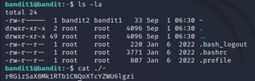
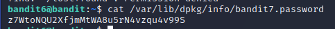
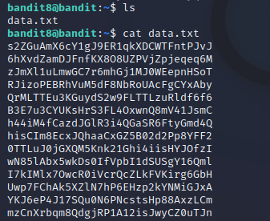

# OverTheWire - Wargames_bandit
**Nhom06 - NT101.N11.ANTN**
> **SVTH: Võ Duy Nhất - MSSV: 20521711**
> 
> **SVTH: Lê Thành Đạt - MSSV: 20521168**

## Level 0
>The goal of this level is for you to log into the game using SSH. The host to which you need to connect is bandit.labs.overthewire.org, on port 2220. The username is bandit0 and the password is bandit0. Once logged in, go to the Level 1 page to find out how to beat Level 1.

Sử dụng ssh truy cập vào `bandit.labs.overthewire.org` với username `bandit0`, password `bandit0` với port 2220

## Level 0 -> Level 1
> The password for the next level is stored in a file called readme located in the home directory. Use this password to log into bandit1 using SSH. Whenever you find a password for a level, use SSH (on port 2220) to log into that level and continue the game.

Đầu tiên, ta dùng lệnh `ls` để liệt kê danh sách các file và thư mục tại thư mục hiện hành thì ta thấy có file `readme`

Dùng lệnh `cat readme` để lấy password truy cập vào bandit1

Password cần tìm là: `NH2SXQwcBdpmTEzi3bvBHMM9H66vVXjL`

## Level 1 -> Level 2
> The password for the next level is stored in a file called - located in the home directory

Dùng password `NH2SXQwcBdpmTEzi3bvBHMM9H66vVXjL` truy cập vào bandit1 (Tương tự như cách tuy cập vào bandit0)

Tiếp theo, ta dùng lệnh `ls` thì thấy có file tên là `-`

Dùng lệnh `cat ./-` để lấy password truy cập vào bandit2

Password cần tìm là: `rRGizSaX8Mk1RTb1CNQoXTcYZWU6lgzi`

## Level 2 -> Level 3
> The password for the next level is stored in a file called spaces in this filename located in the home directory

Dùng password `rRGizSaX8Mk1RTb1CNQoXTcYZWU6lgzi` truy cập vào bandit2 

Dùng lệnh `ls` thì thấy có file tên là `spaces in this filename`

Dùng lệnh `cat “spaces in this filename”` để lấy password truy cập vào bandit3

Password cần tìm là: `aBZ0W5EmUfAf7kHTQeOwd8bauFJ2lAiG`

## Level 3 -> Level 4
> The password for the next level is stored in a hidden file in the inhere directory.

Dùng password `aBZ0W5EmUfAf7kHTQeOwd8bauFJ2lAiG` truy cập vào bandit3

Dùng lệnh `ls -la` để xem toàn bộ thông tin của file và những file ẩn trong thư mục hiện hành

Vào thư mục `inhere` và sử dụng `ls -la` lần nữa ta thấy có 1 file ẩn là `.hidden`

Dùng lệnh `cat .hidden` để xem file ẩn

Password cần tìm là: `2EW7BBsr6aMMoJ2HjW067dm8EgX26xNe`

## Level 4 -> Level 5
> The password for the next level is stored in the only human-readable file in the inhere directory. Tip: if your terminal is messed up, try the “reset” command.

Dùng password `2EW7BBsr6aMMoJ2HjW067dm8EgX26xNe` truy cập vào bandit4

Dùng lệnh `ls -la` và thấy có thư mục `inhere`. Vào thư mục `inhere` thì thấy có 10 file 

Vấn đề đặt ra là ta cần xem thử bên trong 10 file đó có dữ liệu dạng gì. Ta dùng lệnh `find . -type f|xargs file` 

Ta thấy `-file07` có dạng ASCII text, ta mở ra xem thử thì thấy password cần tìm

## Level 5 -> Level 6
>The password for the next level is stored in a file somewhere under the inhere directory and has all of the following properties:
>- human-readable
>- 1033 bytes in size
>- not executable

Dùng password `lrIWWI6bB37kxfiCQZqUdOIYfr6eEeqR` truy cập vào bandit5

Ta thấy có thư mục `inhere`. Truy cập vào thử thì thấy có 20 thư mục

Ta cần tìm file theo đúng yêu cầu là `human-readable, 1033 bytes in size, not executable`. Ta dùng lệnh `find . -type f -size 1033c ! -executable` và thấy có file cần tìm. Lưu ý rằng kí hiệu của `byte` là `c`

Mở file và ta nhận được password

Password cần tìm là: `P4L4vucdmLnm8I7Vl7jG1ApGSfjYKqJU`

## Level 6 -> Level 7
>The password for the next level is stored somewhere on the server and has all of the following properties:
>- owned by user bandit7
>- owned by group bandit6
>- 33 bytes in size

Dùng password `P4L4vucdmLnm8I7Vl7jG1ApGSfjYKqJU` truy cập vào bandit6

Xem thử có file hay thư mục nào ở thư mục hiện hành không thì ta nhận ra không có gì cả

Điều đặt ra ở đây là ta cần tìm `file` ở nơi nào đó có yêu cầu `owned by user bandit7, owned by group bandit6, 33 bytes in size`. Ta dùng lệnh `find / -type f -user bandit7 -group bandit6 -size 33c` để tìm kiếm. 

Sau một lúc tìm kiếm thì ta tìm được đường dẫn `/var/lib/dpkg/info/bandit7.password` không bị `Permission denied`

Mở file và ta được password cần tìm

Password cần tìm là: `z7WtoNQU2XfjmMtWA8u5rN4vzqu4v99S`

## Level 7 -> Level 8
>The password for the next level is stored in the file data.txt next to the word millionth

Dùng password `z7WtoNQU2XfjmMtWA8u5rN4vzqu4v99S` để truy cập vào bandit7

Dùng `ls` thì ta thấy được 1 file `data.txt`. Mở file thì ta nhận được các chuỗi khác nhau

Ta dùng lệnh `cat data.txt|grep millionth` để tìm kiếm từ khóa `millionth` trong file thì ta tìm thấy kèm với password

Password cần tìm là: `TESKZC0XvTetK0S9xNwm25STk5iWrBvP`

## Level 8 -> Level 9
>The password for the next level is stored in the file data.txt and is the only line of text that occurs only once

Dùng password `TESKZC0XvTetK0S9xNwm25STk5iWrBvP` để truy cập vào bandit8

Dùng `ls` ta thấy có 1 file `data.txt`. Mở file để xem thử thì thấy có rất nhiều chuỗi

Ta cần tìm chuỗi chỉ xảy ra 1 lần. Ta dùng lệnh `sort data.txt|uniq -c|grep "1 "` với `sort` sẽ sắp xếp file, `uniq -c` sẽ đếm số lượng file lặp và `grep "1 "` sẽ kiếm chuỗi có lần lặp là 1 

Password cần tìm là: `EN632PlfYiZbn3PhVK3XOGSlNInNE00t`

## Level 9 -> Level 10
> The password for the next level is stored in the file data.txt in one of the few human-readable strings, preceded by several ‘=’ characters.

Dùng password `EN632PlfYiZbn3PhVK3XOGSlNInNE00t` để truy cập vào bandit9

Dùng `ls` ta thấy có 1 file `data.txt`. Dùng `strings data.txt` để xem chuỗi bên trong file

Đề yêu cầu password đứng trước 1 số dấu "=". Vì vậy nên ta `grep "="` thử và tìm thấy password

Password cần tìm là: `G7w8LIi6J3kTb8A7j9LgrywtEUlyyp6s`

## Level 10 -> Level 11
> The password for the next level is stored in the file data.txt, which contains base64 encoded data

Dùng password `G7w8LIi6J3kTb8A7j9LgrywtEUlyyp6s` để truy cập vào bandit11

Dùng `ls` ta thấy có 1 file `data.txt`. Dùng `strings data.txt` để xem chuỗi bên trong file

Ta cần decode base64 đoạn mã này. Ta dùng lệnh `base64 -d` và tìm được password 

Password cần tìm là: `6zPeziLdR2RKNdNYFNb6nVCKzphlXHBM`

## Level 11 -> Level 12
> The password for the next level is stored in the file data.txt, where all lowercase (a-z) and uppercase (A-Z) letters have been rotated by 13 positions

Dùng password `6zPeziLdR2RKNdNYFNb6nVCKzphlXHBM` để truy cập vào bandit11

Dùng `ls` ta thấy có 1 file `data.txt`. Dùng `strings data.txt` để xem chuỗi bên trong file

Ta cần luân chuyển những chuỗi trên 13 kí tự. Ta dùng lệnh `tr 'A-Za-z' 'N-ZA-Mn-za-m'` để dịch chuyển đi 13 kí tự

Password cần tìm là: `JVNBBFSmZwKKOP0XbFXOoW8chDz5yVRv`

## Level 12 -> Level 13
>The password for the next level is stored in the file data.txt, which is a hexdump of a file that has been repeatedly compressed. For this level it may be useful to create a directory under /tmp in which you can work using mkdir. For example: mkdir /tmp/myname123. Then copy the datafile using cp, and rename it using mv (read the manpages!)

Dùng password `JVNBBFSmZwKKOP0XbFXOoW8chDz5yVRv` để truy cập vào bandit12

Dùng `ls` ta thấy có 1 file `data.txt`. Dùng `strings data.txt` để xem file 

Để thuận tiện xử lí file ta tạo một thư mục mới `/tmp/nhat` rồi sao chép file `data.txt` về đó.

Vì `data.txt` là 1 file `hexdump`. Ta reverse bằng lệnh `xxd` để chuyển file về dạng binary

Vì file `data` có dạng `gzip` nên ta chuyển file `data` thành `data.gzip` và giải nén, ta được file `data` dạng `bzip2`

Tiếp tục `mv` file về dạng `data.bz2` rồi giải nén, ta được file `data` dạng `gzip`

Tiếp tục giải nén như trên ta được file dạng `tar`

`mv` file về dạng `data.tar` rồi giải nén ta được file tiếp tục dạng `tar` 

Ta liên tục lặp lại các bước như trên rồi giải nén, ta cuối cùng cũng tìm được file chứa password 

Password cần tìm là: `wbWdlBxEir4CaE8LaPhauuOo6pwRmrDw`

## Level 13 -> Level 14
> The password for the next level is stored in /etc/bandit_pass/bandit14 and can only be read by user bandit14. For this level, you don’t get the next password, but you get a private SSH key that can be used to log into the next level. Note: localhost is a hostname that refers to the machine you are working on

Dùng password `wbWdlBxEir4CaE8LaPhauuOo6pwRmrDw` để truy cập vào bandit13

Dùng `ls` ta thấy được 1 private key ssh 

Ta dùng lệnh `scp` để download key về máy, sau đó thiết lập cấp quyền read cho user  

Dùng `ssh` truy cập ở local,  sau đó `cat /etc/bandit_pass/bandit14` ta được password

Password cần tìm là: `fGrHPx402xGC7U7rXKDaxiWFTOiF0ENq`

## Level 14 -> Level 15
> The password for the next level can be retrieved by submitting the password of the current level to port 30000 on localhost.

Ở challenge trước ta tìm được password là `fGrHPx402xGC7U7rXKDaxiWFTOiF0ENq`. Dùng `nc`, gửi password này đến port 30000 ta được password

Password cần tìm là: `jN2kgmIXJ6fShzhT2avhotn4Zcka6tnt`

## Level 15 -> Level 16
>The password for the next level can be retrieved by submitting the password of the current level to port 30001 on localhost using SSL encryption.

Dùng password `jN2kgmIXJ6fShzhT2avhotn4Zcka6tnt` để truy cập vào bandit15

Đầu tiên ta dùng lệnh `cat /etc/bandit_pass/bandit15` để lấy password cần gửi. 

Sau khi thử lệnh `nc` không thành công vì không options `ssl`, em thử qua lệnh `ncat` thì tìm thấy options `ssl` để thực thi

Thưc thi lệnh `ncat --ssl localhost 30001` rồi gửi password đã kiếm ở trên ta được password cần tìm

Passwword cần tìm là: `JQttfApK4SeyHwDlI9SXGR50qclOAil1`

## Level 16 -> Level 17
>The credentials for the next level can be retrieved by submitting the password of the current level to a port on localhost in the range 31000 to 32000. First find out which of these ports have a server listening on them. Then find out which of those speak SSL and which don’t. There is only 1 server that will give the next credentials, the others will simply send back to you whatever you send to it.

Dùng password `JQttfApK4SeyHwDlI9SXGR50qclOAil1` để truy cập vào bandit16

Đầu tiên ta dùng lệnh `cat /etc/bandit_pass/bandit16` để lấy password cần gửi. 

Ta dùng lệnh `nmap localhost -p 31000-32000` để xem các port trong khoảng từ 31000 đến 32000

Thử gửi password với từng port bằng lệnh `ncat` thì chỉ có port 31790 trả về correct 1 key rsa còn tất cả port khác chỉ gửi lại password mà mình đã gửi

`Copy` key rồi `exit` bandit16, sau đó `paste` vào trình soạn thảo vim với tên pass rồi lưu lại. 

Chạy lệnh `ssh -i pass bandit17@bandit.labs.overthewire.org -p 2220`, ta truy cập được vào bandit17

